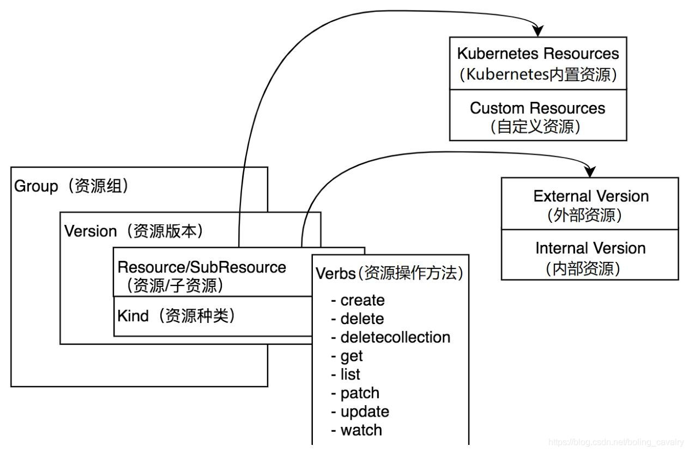

### client-go examples


### 参考

- [k8s-client-go](https://github.com/owenliang/k8s-client-go)
- [kube-client-example](https://github.com/cliterb/kube-client-example)
- [client-go 实战](https://xinchen.blog.csdn.net/article/details/113753087)
- [client-go/example](https://github.com/kubernetes/client-go/tree/master/examples)


### 关于 Group、Version、Resource



- deployment 有 group 和 version
- pod 只有 version 

Version

> ```bash
> kubectl api-versions | sort -u 
> ```
>
> 
>
> admissionregistration.k8s.io/v1
> apiextensions.k8s.io/v1
> apiregistration.k8s.io/v1
> apps/v1
> argoproj.io/v1alpha1
> authentication.k8s.io/v1
> authorization.k8s.io/v1
> autoscaling/v1
> autoscaling/v2
> autoscaling/v2beta1
> autoscaling/v2beta2
> batch/v1
> batch/v1beta1
> certificates.k8s.io/v1
> coordination.k8s.io/v1
> discovery.k8s.io/v1
> discovery.k8s.io/v1beta1
> events.k8s.io/v1
> events.k8s.io/v1beta1
> flowcontrol.apiserver.k8s.io/v1beta1
> flowcontrol.apiserver.k8s.io/v1beta2
> metrics.k8s.io/v1beta1
> networking.k8s.io/v1
> node.k8s.io/v1
> node.k8s.io/v1beta1
> policy/v1
> policy/v1beta1
> rbac.authorization.k8s.io/v1
> scheduling.k8s.io/v1
> storage.k8s.io/v1
> storage.k8s.io/v1beta1
> v1
